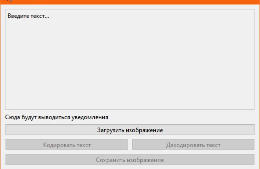

МИНИСТЕРСТВО НАУКИ  И ВЫСШЕГО ОБРАЗОВАНИЯ РОССИЙСКОЙ ФЕДЕРАЦИИ 
Федеральное государственное автономное образовательное учреждение высшего образования 
"КРЫМСКИЙ ФЕДЕРАЛЬНЫЙ УНИВЕРСИТЕТ им. В. И. ВЕРНАДСКОГО" 
ФИЗИКО-ТЕХНИЧЕСКИЙ ИНСТИТУТ 
Кафедра компьютерной инженерии и моделирования

 

<h3 align="center">Отчёт по лабораторной работе № 5  по дисциплине "Программирование"</h3>
  

студента 1 курса группы ПИ-б-о-201(1) 
Журавлёва Дарья Вячеславовна 
направления подготовки 09.03.04 "Программная инженерия"

  

<table>
<tr><td>Научный руководитель  старший преподаватель кафедры  компьютерной инженерии и моделирования</td>
<td>(оценка)</td>
<td>Чабанов В.В.</td>
</tr>
</table>
  

Симферополь, 2021

# Лабораторная работа №5 Стенография

## **Цель:**

1. Изучить базовые встроенные элементы фреймворка Qt предназначенные для создания приложений с графическим интерфейсом пользователя (GUI);
2. Изучить сигнально-слотовую систему, как один из способов организации взаимодействия компонентов GUI;
3. Получить практический навык работы с побитовыми операторами.

### **Постановка задачи**

Создать десктоп приложение с GUI позволяющее сохранять текстовую информацию в изображение формата png без видимого изменения исходного изображения. Приложение должно позволять сохранять текст в картинку и извлекать текст из картинки.

### **Ход работы**

Был подготовлен графический интерфейс программы в соответствии с методическими указаниями.

###### Рисунок 1. Графический интерфейс

Далее был создан проект c++ qt. Добавлены элементы графического интерфейса на форму, после чего настроены и подключены к слотам. После этого была написана часть отвечающая за загрузку и сохранение изображения, а также логику шифрации и дешифрации сообщения. После проверки корректности работы кода, был создан проект на языке Python. Далее код на языке С++ был переписан на язык Python.

###### Рисунок 2. Рисунок с зашифрованным текстом для проверки

Ответ на вопрос про зашифрованное сообщение: Как зовут и что он обещал?
"Привет. Меня зовут Rick Astley. И я хочу поделиться с вами трейлером Grand Theft Auto VI уже сегодня. Жмите на кнопу и приятного просмотра"

Ответ: Rick Astley, показывает трейлер GTA VI

###### Рисунок 3. Рисунок с зашифрованным текстом

#### **Вывод по работе**

В ходе лабораторной работы я изучила базовые встроенные элементы фреймворка Qt предназначенные для создания приложений с графическим интерфейсом пользователя